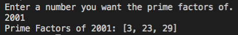

# Overview
Finds the prime factor of a number. Written in Java.

# Development Environment
* Visual Studio Code 1.51.1
* Java Extension Pak 0.12.0
* Java SE 15

# Execution
Click play on Visual Studios

# Useful Websites
* [Java Wikipedia](https://en.wikipedia.org/wiki/Java_(programming_language))
* [Java Tutorials W3Schools](https://www.w3schools.com/java/default.asp)
* [Java Reference Oracle](https://docs.oracle.com/en/java/javase/index.html)
* [More Java Tutorials](https://beginnersbook.com/java-collections-tutorials/)
